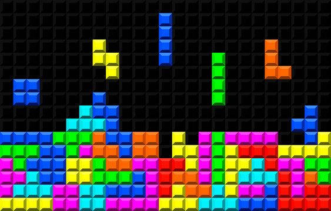

# PROYECTO TETRIS CON JAVASCRIPT
## Juan Martín Candela - 2ºDAW

### ÍNDICE
1. PASOS DE CREACIÓN DEL PROYECTO
2. TECNOLOGÍAS REQUERIDAS

### 1.- PASOS DE CREACIÓN DEL PROYECTO :rocket:

* Creación de un tablero Canvas de coordenadas.
* Determinación de la posición inicial de las figuras \(tetriminos\).
* Rotación y movimiento de las figuras
* Control  de colisiones
* Game - Over 

#### 1.1.- EJEMPLO DE CODIGO HTML INICIAL :speech_balloon:

> ***Este es un ejemplo-prototipo muy básico*** 
~~~
<body>

</body>
~~~

### 2.- TECNOLOGÍAS REQUERIDAS :space_invader:

Este proyecto web es desarrollado con varias tecnologías entre las
que se incluyen: **Javascript, HTML5, CSS3**

Para más información sobre las tecnologías consulte los siguientes enlaces:

* [JavaScript][javascript-info]
* [HTML5][html5-info]
* [CSS3](https://www.w3schools.com/cssref/index.php)

[javascript-info]:https://javascript.info/
[html5-info]:https://dev.w3.org/html5/spec-LC/